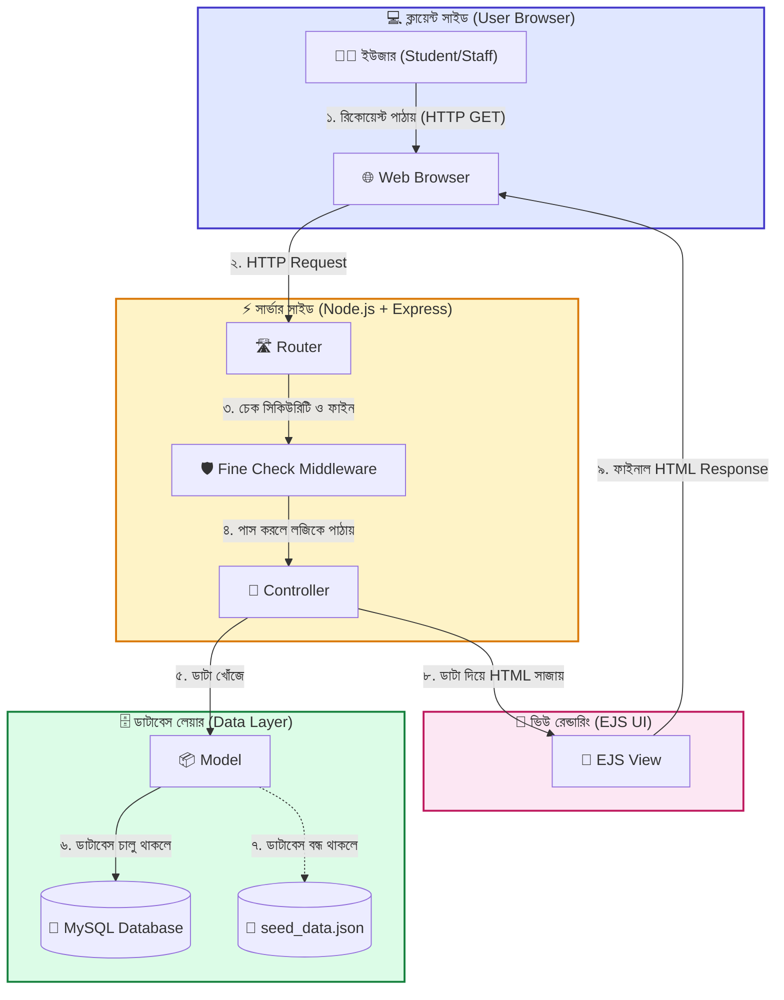
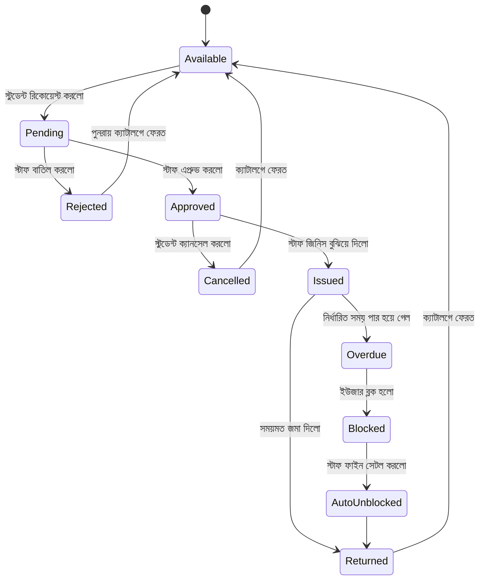
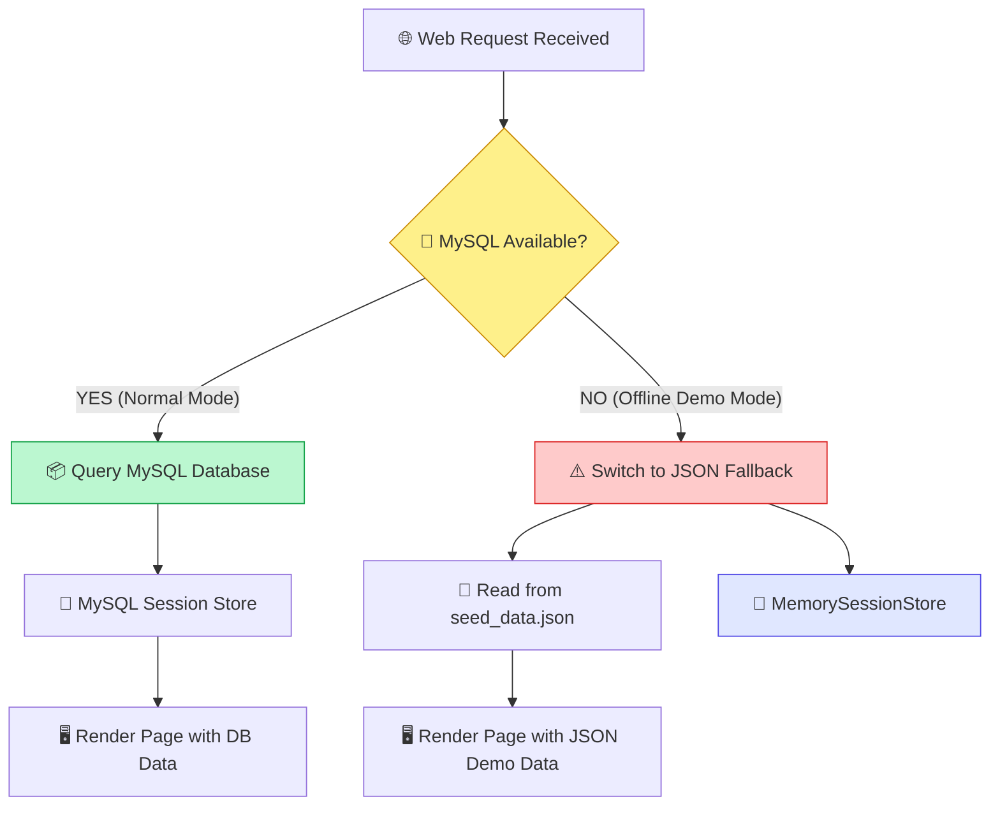
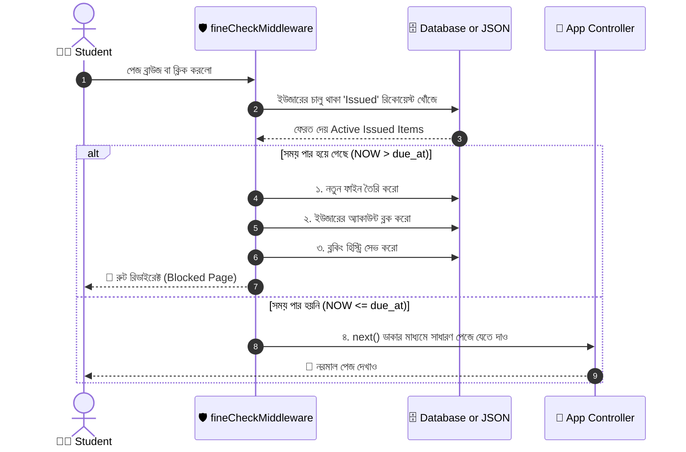
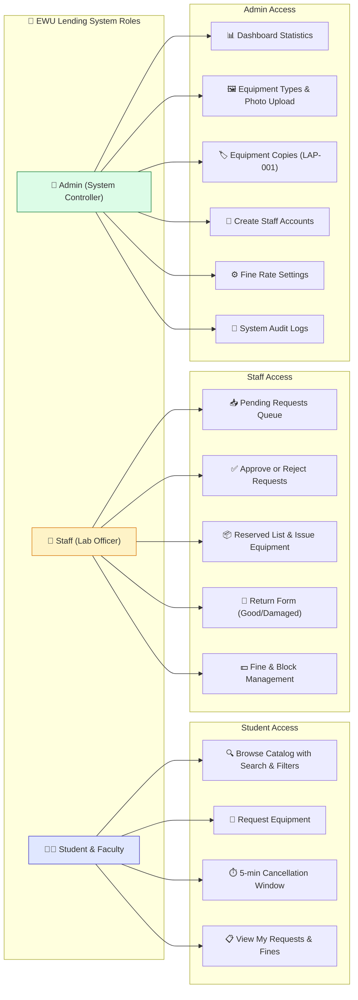

# 🎓 EWU Equipment Lending System — সম্পূর্ণ কোর্স, ভিজ্যুয়াল ডায়াগ্রাম ও ভাইভা গাইড

> **বিশেষ নির্দেশনা:** এই ডকুমেন্টটি ভিজ্যুয়াল ডায়াগ্রাম (**Mermaid Visual Diagrams**), ভিজ্যুয়াল ফ্লোচার্ট এবং সহজ বাংলা ব্যাখ্যার সমন্বয়ে তৈরি। একজন নতুন শিক্ষার্থী খুব সহজে ছবি দেখে ও ডায়াগ্রাম বুঝে পুরো প্রজেক্টের লজিক, আর্কিটেকচার এবং ভাইভার প্রশ্ন আয়ত্ত করতে পারবে।

---

# 📚 সূচিপত্র (Table of Contents)
1. [🏫 পার্ট ১: একদম নতুনদের জন্য ভিজ্যুয়াল ওয়েব ডেভেলপমেন্ট (Visual Crash Course)](#-পার্ট-১-একদম-নতুনদের-জন্য-ভিজ্যুয়াল-ওয়েব-ডেভেলপমেন্ট-visual-crash-course)
2. [🗺️ পার্ট ২: ইকুইপমেন্টের জীবনচক্র ডায়াগ্রাম (Equipment Status Lifecycle)](#-পার্ট-২-ইকুইপমেন্টের-জীবনচক্র-ডায়াগ্রাম-equipment-status-lifecycle)
3. [🏗️ পার্ট ৩: সিস্টেম আর্কিটেকচার ও ডাটাবেস ফলব্যাক ডায়াগ্রাম (Architecture & Fallback)](#-পার্ট-৩-সিস্টেম-আর্কিটেকচার-ও-ডাটাবেস-ফলব্যাক-ডায়াগ্রাম-architecture--fallback)
4. [⚡ পার্ট ৪: ফাইন চেক ও অটো-ব্লক সেকুয়েন্স ডায়াগ্রাম (Middleware Flow)](#-পার্ট-৪-ফাইন-চেক-ও-অটো-ব্লক-সেকুয়েন্স-ডায়াগ্রাম-middleware-flow)
5. [👑 পার্ট ৫: রোল ও পারমিশন ফ্লোচার্ট (Role & Access Control)](#-পার্ট-৫-রোল-ও-পারমিশন-ফ্লোচার্ট-role--access-control)
6. [🛠️ পার্ট ৬: জিরো থেকে এমন প্রজেক্ট কীভাবে বানাতে হয় (Build Guide)](#-পার্ট-৬-জিরো-থেকে-এমন-প্রজেক্ট-কীভাবে-বানাতে-হয়-build-guide)
7. [💻 পার্ট ৭: মূল কোডের লাইন-বাই-লাইন ব্যাখ্যা (Line-by-Line Code Breakdown)](#-পার্ট-৭-মূল-কোডের-লাইন-বাই-লাইন-ব্যাখ্যা-line-by-line-code-breakdown)
8. [🎤 পার্ট ৮: শিক্ষক বা ভাইভা বোর্ডের ১৫টি প্রশ্ন ও উত্তর (Viva Q&A)](#-পার্ট-৮-শিক্ষক-বা-ভাইভা-বোর্ডের-১৫টি-প্রশ্ন-ও-উত্তর-viva-qa)

---

# 🏫 পার্ট ১: একদম নতুনদের জন্য ভিজ্যুয়াল ওয়েব ডেভেলপমেন্ট (Visual Crash Course)

### 🍽️ ১.১ ওয়েবসাইট কীভাবে কাজ করে? (Mermaid Flowchart)

নিচের ডায়াগ্রামটি দেখলে বুঝবেন একটি ওয়েবসাইট কীভাবে ব্রাউজার থেকে সার্ভার ও ডাটাবেসে গিয়ে ফেরত আসে:



---

# 🗺️ পার্ট ২: ইকুইপমেন্টের জীবনচক্র ডায়াগ্রাম (Equipment Status Lifecycle)

ল্যাবের একটি ইকুইপমেন্ট (যেমন: `LAP-001`) আবেদন থেকে শুরু করে ফেরত দেওয়া বা লেট হয়ে জরিমানা হওয়া পর্যন্ত কী কী অবস্থার (States) মধ্য দিয়ে যায়:



---

# 🏗️ পার্ট ৩: সিস্টেম আর্কিটেকচার ও ডাটাবেস ফলব্যাক ডায়াগ্রাম (Architecture & Fallback)

আমাদের প্রজেক্টের **Dual-Mode System** কীভাবে ডাটাবেস ব্যর্থ হলেও মেমোরি ও JSON ব্যবহার করে সাইট সচল রাখে:



---

# ⚡ পার্ট ৪: ফাইন চেক ও অটো-ব্লক সেকুয়েন্স ডায়াগ্রাম (Middleware Flow)

কোনো Cron Job ছাড়াই **`fineCheckMiddleware.js`** কীভাবে ইউজারের প্রতিটি পেজ রিকোয়েস্টে লেট ডিটেক্ট করে:



---

# 👑 পার্ট ৫: রোল ও পারমিশন ফ্লোচার্ট (Role & Access Control)

সিস্টেমে ৩টি রোল কোন কোন পেজে এক্সেস পাবে:



---

# 🛠️ পার্ট ৬: জিরো থেকে এমন প্রজেক্ট কীভাবে বানাতে হয় (Build Guide)

আপনি যদি নতুন একটি প্রজেক্ট শূন্য থেকে বানাতে চান, তবে এই ৭টি ধাপে বানাতে হবে:

```text
[Step 1: Folder & npm init] ➔ [Step 2: Install Packages] ➔ [Step 3: App Server Setup] 
       ➔ [Step 4: DB Connection] ➔ [Step 5: Routes & Controllers] ➔ [Step 6: EJS Views] ➔ [Step 7: Middleware Security]
```

### 🔹 Step 1: প্রজেক্ট ফোল্ডার ও লাইব্রেরি শুরু করা
```bash
mkdir my-project
cd my-project
npm init -y
```

### 🔹 Step 2: প্রয়োজনীয় প্যাকেজসমূহ ইনস্টল করা
```bash
npm install express ejs mysql2 express-session connect-flash dotenv method-override bcrypt
```

### 🔹 Step 3: সার্ভার এন্ট্রি ফাইল (`app.js`) বানানো
```javascript
const express = require('express');
const app = express();

app.set('view engine', 'ejs'); // HTML রেন্ডার করার জন্য EJS সেটআপ

app.get('/', (req, res) => {
    res.send('Welcome to Equipment Lending System!');
});

app.listen(3000, () => {
    console.log('Server is running on http://localhost:3000');
});
```

---

# 💻 পার্ট ৭: মূল কোডের লাইন-বাই-লাইন ব্যাখ্যা (Line-by-Line Code Breakdown)

### 📄 ৭.১ `controllers/authController.js` (EWU Email Validation)

```javascript
// ১. ইউজার ফর্ম থেকে পাঠানো ডাটা ধরছি
const { name, email, password, password2, role } = req.body;

// ২. ইমেইলটিকে ছোট হাতের অক্ষরে রূপান্তর করছি
const emailLower = email.trim().toLowerCase();

// ৩. স্টুডেন্ট হলে চেক করছি ইমেইলের শেষে '@std.ewubd.edu' আছে কিনা
if (role === 'Student' && !emailLower.endsWith('@std.ewubd.edu')) {
    req.flash('error_msg', 'Students must register with their @std.ewubd.edu email address.');
    return res.redirect('/auth/signup');
}

// ৪. ফ্যাকাল্টি হলে চেক করছি ইমেইলের শেষে '@ewubd.edu' আছে কিনা
if (role === 'Faculty' && !emailLower.endsWith('@ewubd.edu')) {
    req.flash('error_msg', 'Faculty must register with their @ewubd.edu email address.');
    return res.redirect('/auth/signup');
}
```

---

### 📄 ৭.২ `middleware/fineCheckMiddleware.js` (স্বয়ংক্রিয় ফাইন ও ব্লক লজিক)

```javascript
module.exports = async function fineCheckMiddleware(req, res, next) {
    if (!req.session.user || req.session.user.role === 'Admin' || req.session.user.role === 'Staff') {
        return next();
    }

    const userId = req.session.user.id;
    const activeRequests = await Request.findIssuedByUserId(userId);
    const now = new Date();

    for (const request of activeRequests) {
        const dueAt = new Date(request.due_at);

        // যদি বর্তমান সময় (now) ফেরতের শেষ সময় (dueAt) অতিক্রম করে!
        if (now > dueAt) {
            const diffMs = now - dueAt;
            const diffDays = Math.ceil(diffMs / (1000 * 60 * 60 * 24));
            
            const ratePerDay = await Setting.get('late_fine_rate_per_day') || 50;
            const fineAmount = diffDays * ratePerDay;

            // ডাটাবেসে ফাইনের নতুন এন্ট্রি তৈরি এবং ইউজার ব্লক করা
            await Fine.create({ user_id: userId, request_id: request.id, amount: fineAmount });
            await User.updateStatus(userId, 'Blocked');
            await Block.create({ user_id: userId, reason: 'Overdue Equipment', block_type: 'Auto' });
        }
    }

    next();
};
```

---

# 🎤 পার্ট ৮: শিক্ষক বা ভাইভা বোর্ডের ১৫টি প্রশ্ন ও উত্তর (Viva Q&A)

#### 🟢 ১. প্রশ্ন: আপনার প্রজেক্টটি কী কাজ করে এবং কার জন্য তৈরি?
> **উত্তর:** "স্যার, আমাদের প্রজেক্টের নাম **EWU Equipment Lending System**। এটি ইস্ট ওয়েস্ট ইউনিভার্সিটির ল্যাব ইকুইপমেন্ট ডিজিটালভাবে ধার দেওয়া ও ট্র্যাকিং করার স্মার্ট ম্যানেজমেন্ট সিস্টেম। এটি Student, Staff এবং Admin—এই ৩টি রোলে কাজ করে।"

#### 🟢 ২. প্রশ্ন: কোডিং স্ট্রাকচারে কোন আর্কিটেকচার ব্যবহার করা হয়েছে?
> **উত্তর:** "আমরা জনপ্রিয় **MVC (Model-View-Controller)** আর্কিটেকচার ব্যবহার করেছি। কোড ক্লিন ও মেইনটেইন করা সহজ করার জন্য আমরা ডাটাবেস (Model), ডিজাইন (View) এবং লজিক (Controller) আলাদা রেখেছি।"

#### 🟢 ৩. প্রশ্ন: স্টুডেন্ট রেজিস্ট্রেশনে ইমেইল কীভাবে ভ্যালিডেট করেছ?
> **উত্তর:** "আমরা সার্ভার সাইডে `authController.js` এ `endsWith()` মেথড দিয়ে চেক করেছি স্টুডেন্ট ইমেইল `@std.ewubd.edu` এবং ফ্যাকাল্টি ইমেইল `@ewubd.edu` কিনা। অন্য কোনো ইমেইল দিলে সিস্টেম রেজিস্ট্রেশন রিজেক্ট করে।"

#### 🟢 ৪. প্রশ্ন: ব্যাকগ্রাউন্ডে Cron Job ছাড়াই ওভারডিউ ও ফাইন কীভাবে হিসাব হচ্ছে?
> **উত্তর:** "আমরা **`fineCheckMiddleware.js`** নামের কাস্টম এক্সপ্রেস মিডলওয়্যার বানিয়েছি। স্টুডেন্ট যেকোনো পেজে ঢোকার সাথে সাথে এই মিডলওয়্যার তার শেষ সময় অতিক্রম হয়েছে কিনা চেক করে এবং লেট হলে অন-দ্য-স্পট ফাইন সেভ করে অ্যাকাউন্ট ব্লক করে দেয়।"

#### 🟢 ৫. প্রশ্ন: ফাইন দিলে ইউজার কীভাবে আনব্লক হয়?
> **উত্তর:** "ল্যাব অফিসার ফাইন জমার পর **Mark as Paid** এ চাপ দিলে সিস্টেম চেক করে ইউজারের কোনো Unpaid Fine বাকি আছে কিনা। কোনো ফাইন না থাকলে এবং ব্লকটি `Auto` হলে সিস্টেম একা একাই ইউজারের স্ট্যাটাস `Active` (Unblock) বানিয়ে দেয়।"

#### 🟢 ৬. প্রশ্ন: রিকোয়েস্ট সাবমিট করা মাত্রই কপির স্ট্যাটাস `Pending` কেন হয়?
> **উত্তর:** "যাতে ডুপ্লিকেট বুকিং বা Race Condition না ঘটে। ১টি ল্যাপটপ থাকলে ১ম স্টুডেন্ট আবেদন করা মাত্রই সেটি `Pending` লক হয়ে যায়, ফলে ২য় স্টুডেন্ট সাথে সাথে ক্যাটালগে 'All copies in use' দেখতে পায়।"

#### 🟢 ৭. প্রশ্ন: 5-Minute Cancel Window কী এবং কীভাবে কাজ করে?
> **উত্তর:** "স্টাফ রিকোয়েস্ট এপ্রুভ করার ৫ মিনিটের মধ্যে স্টুডেন্ট নিজের ভুল বুঝতে পারলে বিনামূল্যে আবেদন বাতিল (Cancel) করতে পারে। আমরা `(Current Time - Reserved Time) < 5 minutes` কন্ডিশন দিয়ে ইজেএস ভিউতে বাটনটি ডাইনামিক রেখেছি।"

#### 🟢 ৮. প্রশ্ন: ডাটাবেস বন্ধ হয়ে গেলে ওয়েবসাইট কীভাবে চলে?
> **উত্তর:** "আমরা একটি **Dual-Mode Hybrid System** বানিয়েছি (`db.js` ও `fallback.js`)। ডাটাবেস বন্ধ থাকলে সিস্টেম ক্র্যাশ না করে `data/seed_data.json` ফাইল এবং মেমোরি সেশন ব্যবহার করে রিড-অনলি মোডে ওয়েবসাইট চালু রাখে।"

#### 🟢 ৯. প্রশ্ন: ছবিতে অটো-ক্রপিং কীভাবে কাজ করে?
> **উত্তর:** "ছবি আপলোড করলে ব্রাউজারের `FileReader API` ছবিকে Base64 স্ট্রিপে রূপান্তর করে এবং Tailwind CSS-এর `object-cover` ও `object-center` দিয়ে নিখুঁত ফ্রেমে কাট-ছাট বা ক্রপ করে রেন্ডার করে।"

#### 🟢 ১০. প্রশ্ন: ক্যাটালগের ফিল্টারিং কীভাবে কাজ করে?
> **উত্তর:** "আমরা Vanilla JavaScript দিয়ে রিয়েল-টাইম DOM filtering করেছি। ইউজার টাইপ করলে বা ক্যাটাগরি ড্রপডাউন বদলালে কোনো পেজ রিলোড ছাড়াই কার্ডগুলো সাথে সাথে ফিল্টার ও সর্ট হয়ে যায়।"

#### 🟢 ১১. প্রশ্ন: SQL Injection আক্রমণ প্রতিরোধের জন্য কী ব্যবহার করেছ?
> **উত্তর:** "আমরা সরাসরি কোয়েরিতে ভ্যারিয়েবল যোগ না করে `mysql2` লাইব্রেরির **Parameterized Query (`?` placeholder)** ব্যবহার করেছি, যা ডাটা এস্কেপ করে ডাটাবেস নিরাপদ রাখে।"

#### 🟢 ১২. প্রশ্ন: পাসওয়ার্ড সিকিউরিটি কীভাবে দেওয়া হয়েছে?
> **উত্তর:** "আমরা পাসওয়ার্ড প্লেইন টেক্সটে রাখি না। `bcrypt` লাইব্রেরি ব্যবহার করে ১-ওয়ে ক্রিপ্টোগ্রাফিক হ্যাশিংয়ের মাধ্যমে পাসওয়ার্ড সুরক্ষিত রাখা হয়েছে।"

#### 🟢 ১৩. প্রশ্ন: অডিট লগ (Audit Log) কী কাজে লাগে?
> **উত্তর:** "ল্যাবের প্রতিটি সংবেদনশীল কাজ (যেমন: কে কাকে ব্লক করলো, কে এপ্রুভ করলো) টাইমস্ট্যাম্প সহ `audit_logs` টেবিলে জমায় থাকে যা শুধু এডমিন দেখতে পারেন।"

#### 🟢 ১৪. প্রশ্ন: সর্বনিম্ন কত সময়ের জন্য ইকুইপমেন্ট ধার নেওয়া যায়?
> **উত্তর:** "আমাদের সিস্টেমে ডে (Day) মোডে সর্বনিম্ন ১ দিন এবং মিনিট (Minute) মোডে সর্বনিম্ন ২ মিনিট নির্ধারণ করা হয়েছে।"

#### 🟢 ১৫. প্রশ্ন: ট্রেন এনিমেশন নোটিফিকেশন বারটি কীভাবে তৈরি করেছ?
> **উত্তর:** "আমরা Tailwind CSS ও কাস্টম CSS `@keyframes trainRide` ব্যবহার করে একটি স্মুথ ইনফিনিট লুপের ট্রেন টিঙ্কার বার বানিয়েছি যা পেজের উপরে স্ক্রোল হতে থাকে এবং মাউস রাখলে পজ (Pause) হয়।"

---

*প্রস্তুত করেছেন: Lead Developer Team | ইস্ট ওয়েস্ট বিশ্ববিদ্যালয় ল্যাব ম্যানেজমেন্ট সিস্টেম প্রকল্প*
