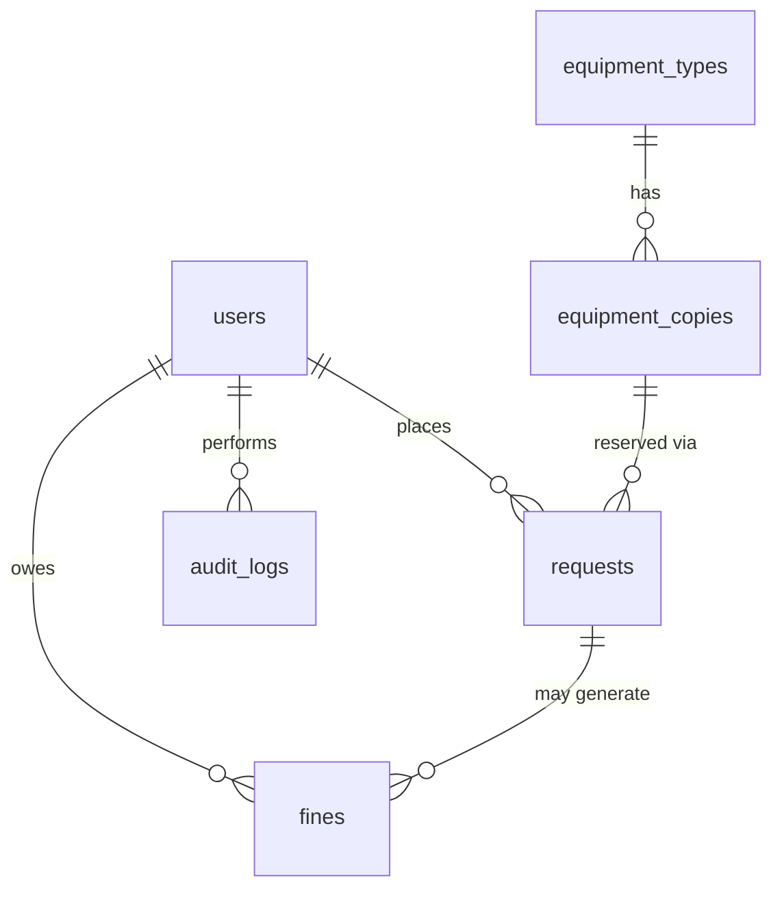
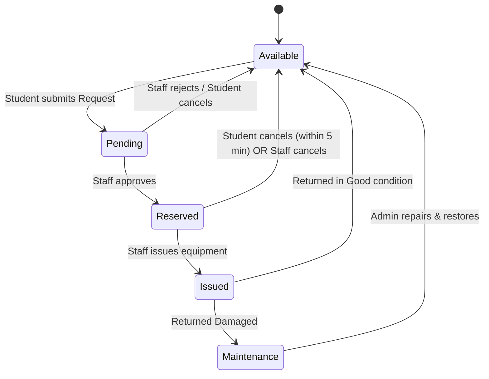
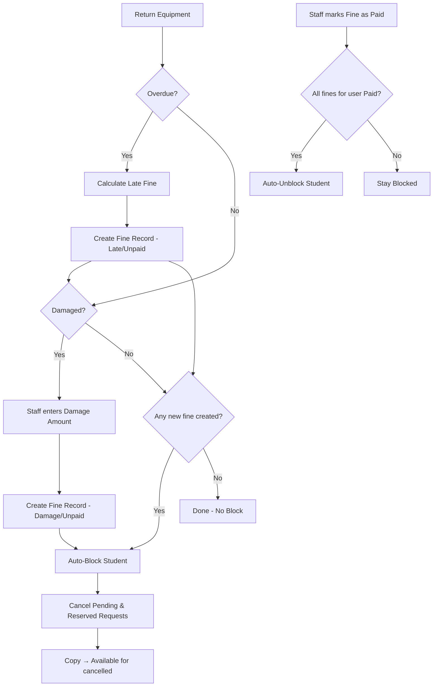

# UELS — Web Architecture (Master Plan)

> **University Equipment Lending System**
> Tech Stack: Node.js · Express.js · EJS · Tailwind CSS (CDN) · MySQL/MariaDB (XAMPP) · bcrypt

---

## Table of Contents

1. [MVC Folder Structure](#1-mvc-folder-structure)
2. [Database Schema](#2-database-schema)
3. [Application Logic Flow](#3-application-logic-flow)
4. [Middleware & Role-Based Access Control](#4-middleware--role-based-access-control)
5. [Database Portability](#5-database-portability)

---

## 1. MVC Folder Structure

```
UELS/
├── config/
│   └── db.js                    # MySQL connection pool (mysql2)
│
├── controllers/
│   ├── authController.js        # Login, Signup, Logout
│   ├── studentController.js     # Student/Faculty: browse, request, history, fines
│   ├── staffController.js       # Staff: approve/reject, issue, return, fine, block
│   └── adminController.js       # Admin: equipment CRUD, dashboard, audit log, settings
│
├── models/
│   ├── User.js                  # users table queries
│   ├── EquipmentType.js         # equipment_types table queries
│   ├── EquipmentCopy.js         # equipment_copies table queries
│   ├── Request.js               # requests table queries
│   ├── Fine.js                  # fines table queries
│   └── AuditLog.js              # audit_logs table queries
│
├── routes/
│   ├── authRoutes.js            # /auth/*
│   ├── studentRoutes.js         # /student/*  (shared by Faculty)
│   ├── staffRoutes.js           # /staff/*
│   └── adminRoutes.js           # /admin/*
│
├── middlewares/
│   ├── authMiddleware.js        # Session check — is user logged in?
│   ├── roleMiddleware.js        # Role gate — is user allowed on this route?
│   ├── blockCheckMiddleware.js  # On login / page load: check fines, apply blocks
│   └── fineCheckMiddleware.js   # On page load: calculate overdue fines on-demand
│
├── views/
│   ├── layouts/
│   │   └── main.ejs             # Master layout (head, navbar, footer)
│   ├── partials/
│   │   ├── navbar.ejs           # Role-aware navigation bar
│   │   ├── footer.ejs
│   │   └── flash.ejs            # Flash message partial
│   ├── auth/
│   │   ├── login.ejs
│   │   └── signup.ejs
│   ├── student/
│   │   ├── dashboard.ejs        # Student/Faculty landing page
│   │   ├── browse.ejs           # Browse equipment catalog
│   │   ├── request.ejs          # New request form
│   │   ├── myRequests.ejs       # Request history
│   │   ├── myFines.ejs          # Fine list & status
│   │   └── blocked.ejs          # Blocked user info page
│   ├── staff/
│   │   ├── dashboard.ejs        # Pending requests queue
│   │   ├── pendingRequests.ejs  # Approve / Reject view
│   │   ├── reservedList.ejs     # Reserved items awaiting pickup
│   │   ├── issuedList.ejs       # Currently issued items
│   │   ├── returnForm.ejs       # Return + condition + damage fine
│   │   ├── fineManagement.ejs   # Mark fines as paid
│   │   ├── blockManagement.ejs  # Manual block / unblock
│   │   └── userSearch.ejs       # Search user for block/fine operations
│   └── admin/
│       ├── dashboard.ejs        # Stats overview
│       ├── equipmentTypes.ejs   # CRUD equipment types
│       ├── equipmentCopies.ejs  # Manage copies per type
│       ├── staffAccounts.ejs    # Create staff accounts
│       ├── fineSettings.ejs     # Set fine rate (per day / per minute)
│       ├── auditLog.ejs         # View all audit logs
│       └── maintenance.ejs      # Items in Maintenance — return to Available
│
├── public/
│   └── css/
│       └── custom.css           # Custom styles beyond Tailwind
│
├── utils/
│   ├── fineCalculator.js        # Late fine calculation with rounding logic
│   └── helpers.js               # Date formatting, misc utilities
│
├── database.sql                 # Full DB schema — portable SQL dump
├── setup.js                     # Auto-create DB + tables + seed Admin
├── .env                         # DB credentials, session secret, fine rate
├── .env.example                 # Template for .env
├── package.json
├── app.js                       # Express app — entry point
└── README.md
```

### Design Decisions

| Decision | Rationale |
|----------|-----------|
| **Faculty reuses Student routes** | PDF states Faculty has *identical* rules to Student — only the `role` label differs. No separate controller needed. |
| **No cron jobs** | All overdue checks and fine calculations happen on page load via middleware (`fineCheckMiddleware`). |
| **Tailwind via CDN** | Academic project — no build step needed. Simply `<script src="...">` in the layout. |
| **Session-based auth** | `express-session` + `express-mysql-session` for session store. Simple, no JWT needed. |

---

## 2. Database Schema

### 2.1 `users`

| Column | Type | Constraints | Notes |
|--------|------|-------------|-------|
| `id` | INT | PK, AUTO_INCREMENT | |
| `name` | VARCHAR(100) | NOT NULL | |
| `email` | VARCHAR(150) | NOT NULL, UNIQUE | Used for login |
| `password_hash` | VARCHAR(255) | NOT NULL | bcrypt hashed |
| `role` | ENUM('Student','Faculty','Staff','Admin') | NOT NULL | |
| `account_status` | ENUM('Active','Blocked') | DEFAULT 'Active' | |
| `block_type` | ENUM('Auto','Manual') | NULLABLE | NULL if not blocked |
| `block_reason` | TEXT | NULLABLE | Reason for block |
| `blocked_by` | INT | NULLABLE, FK → users.id | Who blocked |
| `created_at` | TIMESTAMP | DEFAULT CURRENT_TIMESTAMP | |
| `updated_at` | TIMESTAMP | ON UPDATE CURRENT_TIMESTAMP | |

> **Signup rules:** Students & Faculty sign up themselves. Staff accounts are created by Admin. Admin account is seeded directly into the DB via `setup.js`.

---

### 2.2 `equipment_types`

| Column | Type | Constraints | Notes |
|--------|------|-------------|-------|
| `id` | INT | PK, AUTO_INCREMENT | |
| `name` | VARCHAR(100) | NOT NULL | e.g. "Dell Laptop" |
| `category` | VARCHAR(100) | NOT NULL | e.g. "Laptop", "Projector", "Camera" |
| `description` | TEXT | NULLABLE | Optional details |
| `image_url` | VARCHAR(255) | NULLABLE | Equipment photo path |
| `created_at` | TIMESTAMP | DEFAULT CURRENT_TIMESTAMP | |

---

### 2.3 `equipment_copies`

| Column | Type | Constraints | Notes |
|--------|------|-------------|-------|
| `id` | INT | PK, AUTO_INCREMENT | |
| `equipment_type_id` | INT | FK → equipment_types.id, NOT NULL | |
| `unique_code` | VARCHAR(20) | NOT NULL, UNIQUE | e.g. "LAP-001", "CAM-003" |
| `status` | ENUM('Available','Pending','Reserved','Issued','Maintenance') | DEFAULT 'Available' | |
| `created_at` | TIMESTAMP | DEFAULT CURRENT_TIMESTAMP | |

> **Key rule:** Each physical item is a row here. Admin can add more copies at any time.

---

### 2.4 `requests`

| Column | Type | Constraints | Notes |
|--------|------|-------------|-------|
| `id` | INT | PK, AUTO_INCREMENT | |
| `user_id` | INT | FK → users.id, NOT NULL | Who requested |
| `copy_id` | INT | FK → equipment_copies.id, NOT NULL | Which copy |
| `purpose` | TEXT | NOT NULL | Why they need it |
| `duration_type` | ENUM('Day','Minute') | NOT NULL | |
| `duration_value` | INT | NOT NULL | Min 1 day or 20 minutes |
| `status` | ENUM('Pending','Approved','Rejected','Cancelled','Issued','Returned') | DEFAULT 'Pending' | |
| `requested_at` | TIMESTAMP | DEFAULT CURRENT_TIMESTAMP | When request was submitted |
| `approved_at` | DATETIME | NULLABLE | When Staff approved |
| `reserved_at` | DATETIME | NULLABLE | Same as approved_at (for cancel timer) |
| `issued_at` | DATETIME | NULLABLE | When equipment was handed over — **timer starts here** |
| `due_at` | DATETIME | NULLABLE | `issued_at + duration` — computed at issue time |
| `returned_at` | DATETIME | NULLABLE | When equipment was returned |
| `return_condition` | ENUM('Good','Damaged') | NULLABLE | Set at return |
| `cancelled_by` | ENUM('Student','Staff','System') | NULLABLE | Who cancelled and why |

> **Critical:** `due_at` is only populated when the equipment is **issued**, not when approved. `due_at = issued_at + duration_value (days or minutes)`.

---

### 2.5 `fines`

| Column | Type | Constraints | Notes |
|--------|------|-------------|-------|
| `id` | INT | PK, AUTO_INCREMENT | |
| `request_id` | INT | FK → requests.id, NOT NULL | Linked to which request |
| `user_id` | INT | FK → users.id, NOT NULL | Who owes the fine |
| `fine_type` | ENUM('Late','Damage') | NOT NULL | |
| `amount` | DECIMAL(10,2) | NOT NULL | Calculated or manual |
| `fine_status` | ENUM('Unpaid','Paid') | DEFAULT 'Unpaid' | |
| `paid_confirmed_by` | INT | NULLABLE, FK → users.id | Staff who confirmed payment |
| `paid_at` | DATETIME | NULLABLE | When marked as paid |
| `created_at` | TIMESTAMP | DEFAULT CURRENT_TIMESTAMP | |

> **Both fines possible:** A single request can generate **both** a Late fine and a Damage fine. Both must be paid for unblock.

---

### 2.6 `audit_logs`

| Column | Type | Constraints | Notes |
|--------|------|-------------|-------|
| `id` | INT | PK, AUTO_INCREMENT | |
| `actor_id` | INT | FK → users.id, NOT NULL | Who performed the action |
| `action` | VARCHAR(100) | NOT NULL | e.g. "APPROVE_REQUEST", "ISSUE_EQUIPMENT", "BLOCK_USER", "PAY_FINE" |
| `target_type` | VARCHAR(50) | NULLABLE | e.g. "request", "user", "equipment_copy" |
| `target_id` | INT | NULLABLE | ID of the affected record |
| `details` | TEXT | NULLABLE | JSON or plain text with extra info |
| `created_at` | TIMESTAMP | DEFAULT CURRENT_TIMESTAMP | |

---

### 2.7 `settings` (Utility table)

| Column | Type | Constraints | Notes |
|--------|------|-------------|-------|
| `id` | INT | PK, AUTO_INCREMENT | |
| `key` | VARCHAR(50) | UNIQUE, NOT NULL | e.g. "late_fine_rate_per_day", "late_fine_rate_per_minute" |
| `value` | VARCHAR(100) | NOT NULL | e.g. "50" |
| `updated_at` | TIMESTAMP | ON UPDATE CURRENT_TIMESTAMP | |

> This table stores the Admin-configurable fine rate so it can be changed from the UI without touching code.

---

### ER Diagram (Simplified)



---

## 3. Application Logic Flow

### 3.1 Request → Return Lifecycle



### 3.2 Detailed Step-by-Step

#### Step 1 — Request (Student/Faculty)
1. Student browses equipment catalog, selects an item with `Available` copies.
2. Fills in: **Purpose** (text), **Duration Type** (`Day` or `Minute`), **Duration Value** (min 1 day or 20 min).
3. On submit:
   - System picks the first `Available` copy of that equipment type.
   - Copy status → `Pending`.
   - Request record created with status `Pending`.
   - **Copy is locked immediately** — no one else can request it.

#### Step 2 — Approve / Reject (Staff)
1. Staff sees pending requests queue.
2. Before approving, system checks:
   - Does the student have **any unpaid fines**? → Block approval.
   - Is the student's `account_status` = `Blocked`? → Block approval.
3. **Approve:**
   - Request status → `Approved`.
   - Copy status → `Reserved`.
   - `approved_at` and `reserved_at` = `NOW()`.
   - Audit log entry.
4. **Reject:**
   - Request status → `Rejected`.
   - Copy status → `Available` (released).
   - Audit log entry.

#### Step 3 — Cancel
- **By Student:** Allowed only within **5 minutes** of `reserved_at`. Checked via: `NOW() - reserved_at <= 5 minutes`.
- **By Staff:** Allowed anytime while status is `Reserved` (e.g., student never shows up).
- **By System:** When a user gets blocked, all their `Pending` and `Reserved` requests are auto-cancelled.
- On cancel: Request status → `Cancelled`, Copy status → `Available`.

#### Step 4 — Issue (Staff)
1. Staff clicks "Issue" for a `Reserved` request.
2. System sets:
   - Request status → `Issued`.
   - Copy status → `Issued`.
   - `issued_at` = `NOW()`.
   - `due_at` = `issued_at + duration_value` (in days or minutes depending on `duration_type`).
3. **Timer starts from this moment — not from approval.**
4. Audit log entry.

#### Step 5 — Return: Good Condition (Staff)
1. Staff clicks "Return" → selects condition = `Good`.
2. System checks if `NOW() > due_at`:
   - **If overdue:** Calculate late fine (see §3.3), create fine record, auto-block student.
   - **If on time:** No fine.
3. Request status → `Returned`, `returned_at` = `NOW()`, `return_condition` = `Good`.
4. Copy status → `Available`.
5. Audit log entry.

#### Step 6 — Return: Damaged (Staff)
1. Staff clicks "Return" → selects condition = `Damaged`.
2. Staff **manually enters damage fine amount** (repair cost varies per item).
3. System also checks for lateness and applies late fine if applicable.
4. **Both fines** (Late + Damage) can be created on one return.
5. Request status → `Returned`, `returned_at` = `NOW()`, `return_condition` = `Damaged`.
6. Copy status → `Maintenance`.
7. Student is auto-blocked (because fines exist).
8. Audit log entry.

---

### 3.3 Late Fine Calculation (On-Demand — No Cron Job)

```
FUNCTION calculateLateFine(request):
    IF request.status != 'Issued':
        RETURN null   // only issued items can be overdue

    IF NOW() <= request.due_at:
        RETURN null   // not overdue

    overdue_duration = NOW() - request.due_at

    IF request.duration_type == 'Minute':
        overdue_minutes = CEIL(overdue_duration in minutes)  // Round UP
        fine = overdue_minutes × fine_rate_per_minute
    ELSE IF request.duration_type == 'Day':
        overdue_days = CEIL(overdue_duration in days)         // Round UP
        fine = overdue_days × fine_rate_per_day

    RETURN fine
```

> **Rounding Rule (from PDF):** Even 30 seconds late → 1 minute. Even a few hours late → 1 day. **Always round UP** (`Math.ceil`).

> **When is this called?**
> - When a Student/Faculty logs in or loads their dashboard → `fineCheckMiddleware` runs.
> - When Staff processes a return.
> - The fine is only **created once** as a record. Subsequent page loads read the existing fine record.

---

### 3.4 Fine & Block Logic



#### Auto-Block Trigger
- A fine record is created → immediately set `users.account_status = 'Blocked'`, `block_type = 'Auto'`.
- Auto-cancel all `Pending` and `Reserved` requests of this user.
- Release those copies back to `Available`.

#### Auto-Unblock Trigger
- Staff marks a fine as `Paid`.
- System queries: `SELECT COUNT(*) FROM fines WHERE user_id = ? AND fine_status = 'Unpaid'`.
- If count = 0 → set `users.account_status = 'Active'`, clear `block_type` and `block_reason`.

#### Manual Block (Staff/Admin)
- Staff or Admin manually blocks a user with a reason.
- `block_type = 'Manual'`, `block_reason` = provided text.
- Same side effects: cancel Pending/Reserved, but **does NOT auto-unblock** when fines are paid.
- Only Staff/Admin can manually unblock.

---

### 3.5 The 5-Minute Cancel Window

```
FUNCTION canStudentCancel(request):
    IF request.status != 'Approved':
        RETURN false

    elapsed = NOW() - request.reserved_at
    IF elapsed <= 5 minutes:
        RETURN true   // Student can cancel
    ELSE:
        RETURN false  // Only Staff can cancel now
```

- This is checked **server-side** — not a client-side timer.
- On the frontend, a countdown can be shown for UX, but the **authoritative check is server-side**.

---

### 3.6 On-Demand Checks (No Cron Jobs)

The PDF explicitly states: **No cron jobs. All checks happen on page load.**

| Event | What Happens |
|-------|-------------|
| **Student/Faculty logs in** | `fineCheckMiddleware` scans all their `Issued` requests. If any are overdue and no fine exists yet, a late fine is created and the user is auto-blocked. |
| **Student/Faculty loads dashboard** | Same check runs. Ensures fines are caught even if they didn't log out and back in. |
| **Staff views issued list** | Same overdue check runs for all displayed requests. |
| **Staff processes a return** | Overdue check is done at return time, fine created if applicable. |

---

## 4. Middleware & Role-Based Access Control

### 4.1 Middleware Stack

```
Request → authMiddleware → roleMiddleware → fineCheckMiddleware → Controller
```

#### `authMiddleware.js`
```javascript
// Checks if req.session.user exists.
// If not → redirect to /auth/login.
// Attaches user object to res.locals for EJS templates.
```

#### `roleMiddleware.js`
```javascript
// Factory function: requireRole(...allowedRoles)
// Example: requireRole('Staff', 'Admin')
// Checks req.session.user.role against allowedRoles.
// If not in list → 403 Forbidden page.
```

#### `fineCheckMiddleware.js`
```javascript
// Runs for Student and Faculty routes.
// Queries all Issued requests for this user where due_at < NOW().
// If overdue and no fine record exists → creates late fine + auto-blocks.
// This is the "no cron job" solution — on-demand fine calculation.
```

#### `blockCheckMiddleware.js`
```javascript
// Runs after fineCheckMiddleware.
// If user is Blocked → redirect to /student/blocked page.
// Exception: Allow access to history, fine viewing, and return-related pages.
```

### 4.2 Route Protection Matrix

| Route Group | Allowed Roles | Middleware Chain |
|-------------|--------------|-----------------|
| `GET /auth/login` | Public | None |
| `POST /auth/signup` | Public | None |
| `GET /student/*` | Student, Faculty | auth → role → fineCheck → blockCheck |
| `POST /student/request` | Student, Faculty | auth → role → fineCheck → blockCheck (blocks if Blocked) |
| `GET /staff/*` | Staff | auth → role |
| `POST /staff/approve` | Staff | auth → role |
| `GET /admin/*` | Admin | auth → role |
| `POST /admin/*` | Admin | auth → role |

### 4.3 Session Structure

```javascript
req.session.user = {
    id: 1,
    name: "John Doe",
    email: "john@university.edu",
    role: "Student",           // Student | Faculty | Staff | Admin
    account_status: "Active"   // Active | Blocked
};
```

---

## 5. Database Portability

### Goal
Any team member should be able to clone the project, run **one or two commands**, and have a fully working system on their XAMPP installation.

### 5.1 `database.sql` — Raw SQL Dump

A standalone SQL file that can be imported directly via phpMyAdmin or MySQL CLI:

```sql
-- Usage: mysql -u root -p < database.sql
-- Or import via phpMyAdmin

CREATE DATABASE IF NOT EXISTS uels_db;
USE uels_db;

-- All CREATE TABLE statements
-- Seed data: Admin account, default fine rates, sample equipment (optional)
```

This file will contain:
- `CREATE DATABASE` statement
- All 7 `CREATE TABLE` statements with proper FK constraints
- `INSERT` for the default Admin account (pre-hashed password)
- `INSERT` for default settings (fine rates)

### 5.2 `setup.js` — Automated Setup Script

```javascript
// Usage: node setup.js
//
// What it does:
// 1. Reads .env for DB credentials
// 2. Connects to MySQL (without specifying a database)
// 3. Creates 'uels_db' if not exists
// 4. Creates all tables if not exist
// 5. Seeds Admin account with bcrypt-hashed password
// 6. Seeds default settings (fine_rate_per_day = 50, fine_rate_per_minute = 1)
// 7. Prints success message
```

### 5.3 `.env.example`

```env
# Database
DB_HOST=localhost
DB_PORT=3306
DB_USER=root
DB_PASSWORD=
DB_NAME=uels_db

# Session
SESSION_SECRET=your-secret-key-here

# Admin Seed
ADMIN_NAME=System Admin
ADMIN_EMAIL=admin@uels.edu
ADMIN_PASSWORD=admin123

# Fine Rates (defaults — can be changed from Admin UI)
DEFAULT_FINE_RATE_PER_DAY=50
DEFAULT_FINE_RATE_PER_MINUTE=1
```

### 5.4 Setup Workflow for New Machine

```bash
# 1. Clone the project
git clone <repo-url>
cd UELS

# 2. Install dependencies
npm install

# 3. Start XAMPP (Apache + MySQL)

# 4. Copy and edit environment file
cp .env.example .env
# Edit .env with your MySQL credentials

# 5. Run setup (creates DB, tables, seeds Admin)
node setup.js

# 6. Start the server
npm run dev

# 7. Open browser → http://localhost:3000
# Login as Admin: admin@uels.edu / admin123
```

---

## NPM Dependencies (Planned)

| Package | Purpose |
|---------|---------|
| `express` | Web framework |
| `ejs` | Template engine |
| `express-ejs-layouts` | Layout support for EJS |
| `mysql2` | MySQL driver (Promise-based) |
| `express-session` | Session management |
| `express-mysql-session` | Store sessions in MySQL |
| `bcrypt` | Password hashing |
| `dotenv` | Environment variables |
| `connect-flash` | Flash messages |
| `method-override` | Support PUT/DELETE in forms |
| `nodemon` (dev) | Auto-restart on file changes |

---

> **This document is the single source of truth for the UELS architecture. All coding tasks in `agent.md` reference sections from this document.**
